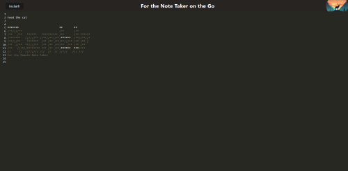

# Ramblr 

A Note App for the Note Taker on the Go 

## Features 
- **Comprehensive Overview** Ramblr is a simple note taking app for those of us with a wanderlust

- **Online or offline** Ramblr will save your notes no matter where you are. 

- **Simplicity** hate your native note taking app and want something with way less features? Well then this is the App for you. 

# Development
- This code was written using VSCode and was developed as a coding bootcamp assignment. 

# Frameworks and Mods
- Ramblr uses codemirror and several node packages including: 
 - Babel, Express, if-env, webpack manifest, and concurrently.

# Credits 
- Ramblr started as a repository for an app known as JATE. The starter code can be found here: 
https://github.com/coding-boot-camp/cautious-meme

# Links 
- Repository: 
https://github.com/Edwardwells87/TheRamblr
- Live App: 
